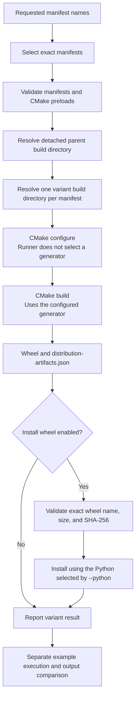

# CGAL Python Binding Variant Runner

The **CGAL Python Binding Variant Runner** (`src/scripts/run`) is the
canonical cross-platform build driver for reproducible CGAL Python
binding variants. It selects declarative JSON manifests by exact name
or selects the complete validated catalog, resolves an isolated build variant
directory for each manifest, and invokes CMake
configure and build stages, records deterministic results and logs, and
can optionally install the exact validated wheel into the Python
environment selected by the user.

The runner is one component of the regression-testing workflow. The
compiled packages it produces are consumed by separate downstream
automation that executes translated Python examples and compares their
behavior with the corresponding C++ references.

## Introduction

### Role

The **CGAL Python Binding Variant Runner** is responsible for the
build and optional installation stages of the `cgalpy` regression
workflow. It consumes validated manifests, creates detached
per-variant build plans, and executes those plans without taking over
the separate example-execution or output-comparison stages.

A successful runner result means that the requested variant was
configured and built successfully and, when explicitly requested, that
its validated wheel was also installed successfully.



### Objectives

Each build variant is described by a validated JSON manifest. A manifest
references one or more existing CMake preload files under `cmake/tests/`.
The runner keeps those CMake configurations as the source of truth while
providing consistent handling for:

- exact manifest selection in command-line order;
- complete catalog selection in deterministic order;
- a detached parent build directory and isolated variant build directories;
- operating-system and compiler policy;
- Release and Debug builds;
- computed or fixed library names;
- CGAL, Python, and nanobind paths;
- parallel builds;
- configure, build, and optional install logs;
- optional installation of the exact validated wheel;
- multiple variants;
- failure reporting and continuation;
- optional local `run_*` launchers.

## Requirements

A live build requires:

- Python 3.8 or later;
- CMake;
- a supported C++ compiler;
- a configured CGAL build;
- nanobind;
- any additional dependencies required by the selected CMake preset.

The runner can be invoked from any directory because it determines the
repository root from the location of `src/scripts/run`.

Display the complete command-line interface with:

```bash
src/scripts/run --help
```

## Quick Start

```bash
# 1. List all available manifests
src/scripts/run --list

# 2. Preview commands for a variant (dry-run)
src/scripts/run sm_pmp_epic --dry-run

# 3. Build a variant
src/scripts/run sm_pmp_epic --cgal-dir <path-to-cgal-build>

# 4. Build all validated manifests
src/scripts/run --all \
  --continue-on-error \
  --cgal-dir <path-to-cgal-build>
```

`--all` selects every validated manifest in deterministic catalog order.
`--continue-on-error` ensures that later manifests are still attempted when
an earlier configure, build, or installation stage fails.

## Default behavior

The runner uses these defaults:

<table>
  <thead>
    <tr>
      <th rowspan="2">Setting</th>
      <th rowspan="2">Name</th>
      <th colspan="3">Default</th>
    </tr>
    <tr>
      <th>Linux</th>
      <th>macOS</th>
      <th>Windows</th>
    </tr>
  </thead>
  <tbody>
    <tr>
      <td><strong>Source directory</strong></td>
      <td><code>source_directory</code></td>
      <td colspan="3">Repository root</td>
    </tr>
    <tr>
      <td><strong>Manifest directory</strong></td>
      <td><code>manifest_directory</code></td>
      <td colspan="3"><code>$source_directory/src/scripts/build_variants/manifests</code></td>
    </tr>
    <tr>
      <td><strong>Parent build directory</strong></td>
      <td><code>build_directory</code></td>
      <td colspan="2"><code>~/build/cgalpy</code></td>
      <td><code>%USERPROFILE%\build\cgalpy</code></td>
    </tr>
    <tr>
      <td><strong>Build type</strong></td>
      <td><code>build_type</code></td>
      <td colspan="3"><code>Release</code></td>
    </tr>
    <tr>
      <td><strong>Library naming</strong></td>
      <td><code>library_name</code></td>
      <td colspan="3">Computed library name</td>
    </tr>
    <tr>
      <td><strong>No. of parallel jobs</strong></td>
      <td><code>job_count</code></td>
      <td colspan="3"><code>4</code></td>
    </tr>
    <tr>
      <td><strong>Operating system</strong></td>
      <td><code>os</code></td>
      <td><code>linux</code></td>
      <td><code>macos</code></td>
      <td><code>windows</code></td>
    </tr>
    <tr>
      <td><strong>Compiler</strong></td>
      <td><code>compiler</code></td>
      <td><code>gcc</code></td>
      <td><code>clang</code></td>
      <td><code>msvc</code></td>
    </tr>
    <tr>
      <td><strong>Python executable</strong></td>
      <td><code>python_executable</code></td>
      <td><code>python</code> / <code>python3</code></td>
      <td><code>python3</code></td>
      <td><code>python.exe</code></td>
    </tr>
    <tr>
      <td><strong>Wheel installation</strong></td>
      <td><code>install_wheel</code></td>
      <td colspan="3">Disabled</td>
    </tr>
  </tbody>
</table>

`build_directory` is the detached parent directory that contains all
runner-managed variant builds. It is not itself a single variant build
directory. For every requested manifest, the runner derives a separate
`variant_build_directory` beneath it using the manifest name, operating
system, compiler identity, library-naming policy, and build type.

In-source builds are rejected. Every variant build directory must be outside the source tree.

Variant build directories use this structure:

```text
<manifest>_<os>_<compiler-tag>_<computed-or-fixed>_<release-or-debug>
```

For example:

```text
sm_pmp_epic_macos_clang_computed_release
```

When an absolute compiler path is used, the compiler tag includes a short
hash. This prevents two compiler paths with the same executable name from
using the same variant build directory.

## Listing available variants

List every validated manifest:

```bash
src/scripts/run --list
```

Each output line contains:

- the manifest name;
- its description;
- the referenced `cmake/tests/*.cmake` files.

Listing manifests does not configure or build anything.

Live and dry-run operations accept exact manifest names in command-line
order or `--all` to select every validated manifest in deterministic catalog
order. The operating-system and compiler options affect the generated build
plan; they do not filter the manifest catalog.

## Manifest format

Manifests are stored in:

```text
src/scripts/build_variants/manifests/
```

Schema version 1 contains exactly four fields:

```json
{
  "schema_version": 1,
  "name": "sm_pmp_epic",
  "description": "Build variant defined by cmake/tests/sm_pmp_epic.cmake",
  "cmake_tests": [
    "cmake/tests/sm_pmp_epic.cmake"
  ]
}
```

The JSON filename without `.json` must match the `name` field.

Manifest names may contain:

- lowercase letters;
- digits;
- underscores;
- hyphens.

Every entry in `cmake_tests` must:

- be a nonempty string;
- be relative to the repository;
- match `cmake/tests/*.cmake`;
- refer to an existing file;
- remain inside the source directory;
- appear only once in the manifest.

The loader rejects:

- missing required fields;
- unknown fields;
- unsupported schema versions;
- invalid manifest names;
- filename and manifest-name mismatches;
- empty descriptions;
- empty `cmake_tests` arrays;
- absolute paths;
- parent-directory traversal;
- missing CMake preload files;
- duplicate preload references.

A manifest may reference several CMake preload files. They are added to the
configure command with separate `-C` arguments in manifest order.

Runner-level overrides, including build type and library naming, are added
after all preload files.

## Inspecting a build with dry-run mode

Use `--dry-run` to inspect the complete resolved plan without executing
CMake or creating a variant build directory:

```bash
src/scripts/run sm_pmp_epic \
  --dry-run \
  --cgal-dir ~/build/cgal/<configured-cgal-build> \
  --python "$(command -v python)" \
  --nanobind-dir "$(python -m nanobind --cmake_dir)"
```

The output includes:

```text
manifest: sm_pmp_epic
variant-build-directory: <resolved-variant-build-directory>
configure-command: <complete-cmake-configure-command>
build-command: <complete-cmake-build-command>
install-wheel: disabled
```

Dry-run mode preserves the order of manifests supplied on the command line
and does not create variant build directories.

## Building one variant

A typical live build is:

```bash
src/scripts/run sm_pmp_epic \
  --build-directory ~/build/cgalpy \
  --cgal-dir ~/build/cgal/<configured-cgal-build> \
  --python "$(command -v python)" \
  --nanobind-dir "$(python -m nanobind --cmake_dir)" \
  --jobs 4 \
  --log-directory ~/build/cgalpy/logs
```

For each selected manifest, the runner:

1. loads and validates the manifest;
2. validates every referenced CMake preload file;
3. resolves a detached variant build directory under the parent
   build directory;
4. creates the variant build directory for live execution;
5. runs the configure command;
6. runs the `BUILD` target only when configure succeeds;
7. streams stage command output to the terminal unless `--quiet` is
   enabled;
8. when requested, validates and installs the generated wheel after a
   successful build;
9. optionally records configure, build, and install logs;
10. reports the final variant result.

The generated build command has this form:

```text
cmake --build <variant-build-directory> --target BUILD \
  --parallel <jobs>
```

The runner does not choose a CMake generator. It supplies
`CMAKE_BUILD_TYPE` during configuration for single-configuration generators.

On Windows, the build command also supplies:

```text
--config <Release-or-Debug>
```

This allows multi-configuration generators, such as Visual Studio, to select
the requested configuration during the build stage.

By default, the runner builds the package without installing it.

## Installing a built wheel

Add `--install-wheel` to install each successfully built variant into the
Python environment selected by `--python`:

```bash
src/scripts/run sm_pmp_epic \
  --install-wheel \
  --pip-install-option=--user \
  --pip-install-option=--no-deps \
  --cgal-dir ~/build/cgal/<configured-cgal-build> \
  --python "$(command -v python)" \
  --nanobind-dir "$(python -m nanobind --cmake_dir)"
```

`--pip-install-option` forwards one additional argument to `pip install`.
Repeat it to forward several arguments. It requires `--install-wheel`, and
each value must be nonempty. Use the `=<value>` form for values beginning
with `-`, such as `--pip-install-option=--user`.

Installation runs only after configuration and compilation succeed. The
runner reads:

```text
<variant-build-directory>/src/libs/cgalpy/dist/distribution-artifacts.json
```

It resolves the exact recorded `.whl` file from the same distribution
directory and validates its filename, recorded byte size, and SHA-256 digest
before starting pip. The selected interpreter then runs the equivalent of:

```text
<python> -m pip install --force-reinstall \
  <forwarded-pip-options> <exact-wheel-file>
```

A failed artifact validation or pip command fails the installation stage and
therefore fails that variant. With `--continue-on-error`, later variants may
still be processed.

## Building several variants

Pass manifest names in the required execution order:

```bash
src/scripts/run sm_pmp_epic psp_epic tri2_wi_hi_epic \
  --cgal-dir ~/build/cgal/<configured-cgal-build> \
  --nanobind-dir "$(python -m nanobind --cmake_dir)"
```

Repeated manifest names in one command are rejected. Explicit manifest
names cannot be combined with `--all`.

Build every validated manifest in catalog order with:

```bash
src/scripts/run --all \
  --continue-on-error \
  --cgal-dir ~/build/cgal/<configured-cgal-build> \
  --nanobind-dir "$(python -m nanobind --cmake_dir)"
```

By default, execution stops after the first failed variant. Variants that
were not attempted are reported as skipped. Use `--continue-on-error` when
the intention is to attempt the complete selected set.

Use `--continue-on-error` to process the remaining variants:

```bash
src/scripts/run sm_pmp_epic psp_epic tri2_wi_hi_epic \
  --continue-on-error \
  --cgal-dir ~/build/cgal/<configured-cgal-build> \
  --nanobind-dir "$(python -m nanobind --cmake_dir)"
```

## Build configuration options

Use a Debug build:

```bash
src/scripts/run sm_pmp_epic --build-type Debug
```

Use the fixed `CGALPY` library name:

```bash
src/scripts/run sm_pmp_epic --fixed-library-name
```

Computed library naming is the default.

Override the detected operating system:

```bash
src/scripts/run sm_pmp_epic --operating-system macos
```

The default compiler values are generic toolchain identities:

- `gcc` on Linux, mapped to the `g++` C++ driver;
- `clang` on macOS, mapped to the `clang++` C++ driver;
- `msvc` on Windows, selected by the active CMake generator.

The generic identity is retained in the variant build directory name. The
mapped C++ driver is passed to CMake through `CMAKE_CXX_COMPILER` where
required.

Override the default with another identity, executable name, or exact path:

```bash
src/scripts/run sm_pmp_epic \
  --compiler /opt/homebrew/bin/clang++
```

Explicit compiler executable names and paths are forwarded unchanged. When
Windows uses the default `msvc` identity, the runner does not add
`CMAKE_CXX_COMPILER`. An explicit Windows compiler such as `clang-cl` is
forwarded to CMake.

## Reducing terminal output

Use quiet mode with:

```text
--quiet
```

Quiet mode adds this definition to the configure command:

```text
-DCMAKE_MESSAGE_LOG_LEVEL:STRING=WARNING
```

Before executing each selected variant, the runner prints one concise progress
line:

```text
variant: <manifest>: <variant-build-directory>
```

Configure, build, and installation subprocess output is not streamed to the
terminal in quiet mode. Final `variant-result` lines are still reported.
When `--log-directory` is also supplied, complete stage output continues to be
written to the corresponding log files.

The planned build command remains generator-neutral through
`cmake --build`. After configuration, quiet execution reads
`CMAKE_GENERATOR` from the variant's `CMakeCache.txt`. When the configured
generator is `Unix Makefiles`, the runner forwards these native Make options:

```text
-- --quiet --no-print-directory
```

Other generators retain the generator-neutral build command without
Make-specific options.

## Refreshing the CMake cache

Remove the existing CMake cache before configuring each selected variant with:

```text
--clean
```

This option removes only:

```text
<variant-build-directory>/CMakeCache.txt
```

The removal occurs immediately before the configure stage. The runner does not
delete the variant build directory or any other files within it.

## Dependency paths

Provide the configured CGAL build directory with:

```text
--cgal-dir <path>
```

Provide the Python interpreter used by CMake and package generation with:

```text
--python <python-executable>
```

Provide nanobind's CMake package directory with:

```text
--nanobind-dir <path>
```

The nanobind path can normally be obtained with:

```bash
python -m nanobind --cmake_dir
```

`--cgal-dir` and `--nanobind-dir` are optional command-line arguments. When
they are omitted, the runner does not add the corresponding CMake
definitions. CMake must then discover those dependencies through the active
environment or another configuration mechanism.

## Logs

Enable per-stage logs with:

```text
--log-directory <directory>
```

The runner uses deterministic filenames:

```text
<manifest>.configure.log
<manifest>.build.log
<manifest>.install.log
```

A build command is not executed when configure fails. Installation is not
attempted when configure or build fails, or when `--install-wheel` is
disabled. An install log is therefore created only when the install stage
actually runs.

Without `--quiet`, command output is streamed to the terminal while also
being written to the selected stage log file. With `--quiet`, subprocess
output is omitted from the terminal but the selected stage log file still
receives the complete output.

## Result states

Final result lines use these forms:

```text
variant-result: <manifest>: success
variant-result: <manifest>: configure-failed (exit <code>)
variant-result: <manifest>: build-failed (exit <code>)
variant-result: <manifest>: install-failed (exit <code>)
variant-result: <manifest>: skipped
```

`skipped` means execution stopped after an earlier failure and
`--continue-on-error` was not enabled.

## Exit codes

| Exit code | Meaning |
| --- | --- |
| `0` | The requested operation completed successfully |
| `1` | One or more executed variants failed |
| `2` | The request or execution setup was invalid |

Exit code `2` covers errors involving:

- command-line arguments;
- manifests;
- source or dependency paths;
- planning;
- command construction;
- output formatting;
- launcher generation;
- log setup;
- command startup.

Standard `argparse` validation errors also exit with code `2`.

## Local `run_*` launchers

The runner can generate thin executable launchers named:

```text
run_<manifest>
```

Generate launchers without configuring or building:

```bash
src/scripts/run sm_pmp_epic psp_epic \
  --generate-run \
  --abort-after-run-generation
```

Launchers are written to the current working directory.

Each launcher:

- invokes the canonical `src/scripts/run` entry point;
- selects one manifest;
- forwards additional command-line arguments;
- is marked executable;
- contains a notice that it must not be committed.

Launcher generation:

- validates all selected manifests before writing;
- uses atomic file creation;
- accepts an existing launcher only when its content is identical;
- refuses to overwrite an existing file with different content.

Without `--abort-after-run-generation`, launcher generation is followed by
dry-run output or live execution according to the remaining options.

Generated launchers are local convenience files. They must not be committed.

## Running the tests

The runner test suite uses Python's standard-library `unittest` framework.
It does not require pytest.

From the repository root, run:

```bash
PYTHONPATH=src/scripts \
python -m unittest discover \
  -s src/scripts/build_variants/tests \
  -p 'test_*.py' \
  -v
```

The test suite covers:

- command-line parsing;
- argument validation;
- operating-system detection;
- manifest validation;
- catalog loading;
- CMake command construction;
- detached build enforcement;
- compiler selection;
- collision-resistant variant build directory names;
- list output;
- dry-run output;
- complete catalog selection with `--all`;
- launcher generation;
- command execution;
- quiet-mode progress and subprocess-output suppression;
- complete stage-log retention in quiet mode;
- selective `CMakeCache.txt` cleanup with unrelated-file preservation;
- log creation;
- configure failures;
- build failures;
- exact wheel filename, byte-size, and SHA-256 validation;
- ordered pip-option forwarding without performing a real installation;
- installation success and failure reporting;
- stop-on-error behavior;
- continue-on-error behavior;
- result reporting;
- exit codes;
- the canonical `src/scripts/run` entry point.

## Adding a new build variant

To add a build variant:

1. Add or identify the required preload file under `cmake/tests/`.
2. Create a schema-version-1 manifest under
   `src/scripts/build_variants/manifests/`.
3. Make the manifest filename match its `name` field.
4. Reference only existing files under `cmake/tests/`.
5. Run `src/scripts/run --list` to validate the full manifest catalog.
6. Inspect the variant with `--dry-run`.
7. Run the complete runner test suite.
8. Build the variant under a detached parent build directory.
9. Record failures using the configure, build, and optional install
   logs.
10. Do not commit generated launchers or build evidence.

## Repository policy

Keep source files and generated output separate:

- runner source and manifests belong in the repository;
- variant build directories belong under a detached parent build
  directory such as `~/build/cgalpy`;
- generated documentation belongs in the build tree;
- generated `run_*` launchers must not be committed;
- configure and build logs belong outside the source tree;
- wheels, source distributions, and validation evidence must not be
  committed;
- `src/libs/cgalpy/lib/docstrings/generated/` must not be recreated.
