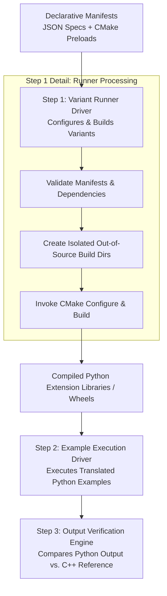

# CGAL Python Binding Variant Runner

The **CGAL Python Binding Variant Runner** (`src/scripts/run`) is a
cross-platform, multi-variant build driver that serves as a component
in the regression testing of CGAL Python bindings automated pipeline.
It processes declarative JSON manifests, referencing underlying CMake
test preload configurations, to handle out-of-source builds across
Linux, macOS, and Windows. By standardizing directory isolation,
parallel execution, logging, and result tracking, the runner enables
systematic verification of binding variations across different CGAL
modules. The compiled Python packages produced by the runner serve as
the foundation for downstream integration tests, where translated
Python example programs are executed and verified against their
reference C++ outputs.

## Introduction

### Role

The **CGAL Python Binding Variant Runner** acts as the primary build driver and orchestration stage within the automated regression testing pipeline for `cgalpy`. Its principal responsibility is to consume declarative JSON manifests and execute **Step 1: Out-of-Source Build Driver**, preparing isolated binary environments across target platforms.

Once the runner completes the compilation phase, downstream automation steps execute and verify the binding variations across distinct CGAL packages.



### Objectives

Each build variant is described by a validated JSON manifest. A manifest
references one or more existing CMake preload files under `cmake/tests/`.
The runner keeps those CMake configurations as the source of truth while
providing consistent handling for:

- detached build directories;
- operating-system and compiler selection;
- Release and Debug builds;
- computed or fixed library names;
- CGAL, Python, and nanobind paths;
- parallel builds;
- configure and build logs;
- multiple variants;
- failure reporting and continuation;
- optional local `run_*` launchers.

## Requirements

A live build requires:

- Python 3.8 or later;
- CMake;
- a supported C++ compiler;
- a configured CGAL build;
- nanobind;
- any additional dependencies required by the selected CMake preset.

The runner can be invoked from any directory because it determines the
repository root from the location of `src/scripts/run`.

Display the complete command-line interface with:

```bash
src/scripts/run --help
```

## Quick Start

```bash
# 1. List all available manifests
src/scripts/run --list

# 2. Preview commands for a variant (dry-run)
src/scripts/run sm_pmp_epic --dry-run

# 3. Build a variant
src/scripts/run sm_pmp_epic --cgal-dir <path-to-cgal-build>
```

## Default behavior

The runner uses these defaults:

<table>
  <thead>
    <tr>
      <th rowspan="2">Setting</th>
      <th rowspan="2">Name</th>
      <th colspan="3">Default</th>
    </tr>
    <tr>
      <th>Linux</th>
      <th>macOS</th>
      <th>Windows</th>
    </tr>
  </thead>
  <tbody>
    <tr>
      <td><strong>Source directory</strong></td>
      <td><code>source_directory</code></td>
      <td colspan="3">Repository root</td>
    </tr>
    <tr>
      <td><strong>Manifest directory</strong></td>
      <td><code>manifest_directory</code></td>
      <td colspan="3"><code><code>$source_directory/src/scripts/build_variants/manifests</code></td>
    </tr>
    <tr>
      <td><strong>Detached build directory</strong></td>
      <td><code>default_build_directory</code></td>
      <td colspan="2"><code>~/build/cgalpy</code></td>
      <td><code>%USERPROFILE%\build\cgalpy</code></td>
    </tr>
    <tr>
      <td><strong>Build type</strong></td>
      <td><code>build_type</code></td>
      <td colspan="3"><code>Release</code></td>
    </tr>
    <tr>
      <td><strong>Library naming</strong></td>
      <td><code>library_name</code></td>
      <td colspan="3">Computed library name</td>
    </tr>
    <tr>
      <td><strong>No. of parallel jobs</strong></td>
      <td><code>job_count</code></td>
      <td colspan="3"><code>4</code></td>
    </tr>
    <tr>
      <td><strong>Operating system</strong></td>
      <td><code>os</code></td>
      <td><code>linux</code></td>
      <td><code>macos</code></td>
      <td><code>windows</code></td>
    </tr>
    <tr>
      <td><strong>Compiler</strong></td>
      <td><code>compiler</code></td>
      <td><code>c++</code></td>
      <td><code>/usr/bin/c++</code></td>
      <td><code>msvc</code></td>
    </tr>
    <tr>
      <td><strong>Python executable</strong></td>
      <td><code>python_executable</code></td>
      <td><code>python</code> / <code>python3</code></td>
      <td><code>python3</code></td>
      <td><code>python.exe</code></td>
    </tr>
  </tbody>
</table>

<!--
| Setting | Default |
| --- | --- |
| Source directory | Repository root |
| Manifest directory | `src/scripts/build_variants/manifests` |
| Detached build directory | `~/build/cgalpy` |
| Build type | `Release` |
| Library naming | Computed library name |
| Parallel jobs | `4` |
| Operating system | Current operating system |
| Linux compiler | `c++` |
| macOS compiler | `/usr/bin/c++` |
| Windows compiler | `msvc` |
| Python executable | Interpreter running the runner |
-->

In-source builds are rejected. Every build directory must be outside the source tree.

Variant build directories use this structure:

```text
<manifest>_<os>_<compiler-tag>_<computed-or-fixed>_<release-or-debug>
```

For example:

```text
sm_pmp_epic_macos_cxx_a7b85a70_computed_release
```

When an absolute compiler path is used, the compiler tag includes a short
hash. This prevents two compiler paths with the same executable name from
using the same build directory.

## Listing available variants

List every validated manifest:

```bash
src/scripts/run --list
```

Each output line contains:

- the manifest name;
- its description;
- the referenced `cmake/tests/*.cmake` files.

Listing manifests does not configure or build anything.

## Manifest format

Manifests are stored in:

```text
src/scripts/build_variants/manifests/
```

Schema version 1 contains exactly four fields:

```json
{
  "schema_version": 1,
  "name": "sm_pmp_epic",
  "description": "Build variant defined by cmake/tests/sm_pmp_epic.cmake",
  "cmake_tests": [
    "cmake/tests/sm_pmp_epic.cmake"
  ]
}
```

The JSON filename without `.json` must match the `name` field.

Manifest names may contain:

- lowercase letters;
- digits;
- underscores;
- hyphens.

Every entry in `cmake_tests` must:

- be a nonempty string;
- be relative to the repository;
- match `cmake/tests/*.cmake`;
- refer to an existing file;
- remain inside the source directory;
- appear only once in the manifest.

The loader rejects:

- missing required fields;
- unknown fields;
- unsupported schema versions;
- invalid manifest names;
- filename and manifest-name mismatches;
- empty descriptions;
- empty `cmake_tests` arrays;
- absolute paths;
- parent-directory traversal;
- missing CMake preload files;
- duplicate preload references.

A manifest may reference several CMake preload files. They are added to the
configure command with separate `-C` arguments in manifest order.

Runner-level overrides, including build type and library naming, are added
after all preload files.

## Inspecting a build with dry-run mode

Use `--dry-run` to inspect the complete resolved plan without executing
CMake or creating a build directory:

```bash
src/scripts/run sm_pmp_epic \
  --dry-run \
  --cgal-dir ~/build/cgal/<configured-cgal-build> \
  --python "$(command -v python)" \
  --nanobind-dir "$(python -m nanobind --cmake_dir)"
```

The output includes:

```text
manifest: sm_pmp_epic
build-directory: <resolved-detached-build-directory>
configure-command: <complete-cmake-configure-command>
build-command: <complete-cmake-build-command>
```

Dry-run mode preserves the order of manifests supplied on the command line
and has no build-directory side effects.

## Building one variant

A typical live build is:

```bash
src/scripts/run sm_pmp_epic \
  --build-root ~/build/cgalpy \
  --cgal-dir ~/build/cgal/<configured-cgal-build> \
  --python "$(command -v python)" \
  --nanobind-dir "$(python -m nanobind --cmake_dir)" \
  --jobs 4 \
  --log-directory ~/build/cgalpy/logs
```

For each selected manifest, the runner:

1. loads and validates the manifest;
2. validates every referenced CMake preload file;
3. resolves a detached build directory;
4. creates that directory for live execution;
5. runs the configure command;
6. runs the `BUILD` target only when configure succeeds;
7. streams command output to the terminal;
8. optionally records configure and build logs;
9. reports the final variant result.

The generated build command has this form:

```text
cmake --build <build-directory> --target BUILD --parallel <jobs>
```

On Windows, the selected build configuration is also provided:

```text
--config <Release-or-Debug>
```

The runner builds the package but does not install the generated wheel.

## Building several variants

Pass manifest names in the required execution order:

```bash
src/scripts/run sm_pmp_epic psp_epic tri2_wi_hi_epic \
  --cgal-dir ~/build/cgal/<configured-cgal-build> \
  --nanobind-dir "$(python -m nanobind --cmake_dir)"
```

Repeated manifest names in one command are rejected.

By default, execution stops after the first failed variant. Variants that
were not attempted are reported as skipped.

Use `--continue-on-error` to process the remaining variants:

```bash
src/scripts/run sm_pmp_epic psp_epic tri2_wi_hi_epic \
  --continue-on-error \
  --cgal-dir ~/build/cgal/<configured-cgal-build> \
  --nanobind-dir "$(python -m nanobind --cmake_dir)"
```

## Build configuration options

Use a Debug build:

```bash
src/scripts/run sm_pmp_epic --build-type Debug
```

Use the fixed `CGALPY` library name:

```bash
src/scripts/run sm_pmp_epic --fixed-library-name
```

Computed library naming is the default.

Override the detected operating system:

```bash
src/scripts/run sm_pmp_epic --operating-system macos
```

Override the default compiler:

```bash
src/scripts/run sm_pmp_epic --compiler /usr/bin/c++
```

When Windows uses the default `msvc` compiler identity, the runner does not
add `CMAKE_CXX_COMPILER`. The active CMake generator selects the MSVC
toolchain.

An explicitly selected Windows compiler, such as `clang-cl`, is forwarded to
CMake through `CMAKE_CXX_COMPILER`.

## Dependency paths

Provide the configured CGAL build directory with:

```text
--cgal-dir <path>
```

Provide the Python interpreter used by CMake and package generation with:

```text
--python <python-executable>
```

Provide nanobind's CMake package directory with:

```text
--nanobind-dir <path>
```

The nanobind path can normally be obtained with:

```bash
python -m nanobind --cmake_dir
```

`--cgal-dir` and `--nanobind-dir` are optional command-line arguments. When
they are omitted, the runner does not add the corresponding CMake
definitions. CMake must then discover those dependencies through the active
environment or another configuration mechanism.

## Logs

Enable per-stage logs with:

```text
--log-directory <directory>
```

The runner uses deterministic filenames:

```text
<manifest>.configure.log
<manifest>.build.log
```

A build command is not executed when configure fails, so no successful build
stage exists for that variant.

Command output is streamed to the terminal while also being written to the
selected log file.

## Result states

Final result lines use these forms:

```text
variant-result: <manifest>: success
variant-result: <manifest>: configure-failed (exit <code>)
variant-result: <manifest>: build-failed (exit <code>)
variant-result: <manifest>: skipped
```

`skipped` means execution stopped after an earlier failure and
`--continue-on-error` was not enabled.

## Exit codes

| Exit code | Meaning |
| --- | --- |
| `0` | The requested operation completed successfully |
| `1` | One or more executed variants failed |
| `2` | The request or execution setup was invalid |

Exit code `2` covers errors involving:

- command-line arguments;
- manifests;
- source or dependency paths;
- planning;
- command construction;
- output formatting;
- launcher generation;
- log setup;
- command startup.

Standard `argparse` validation errors also exit with code `2`.

## Local `run_*` launchers

The runner can generate thin executable launchers named:

```text
run_<manifest>
```

Generate launchers without configuring or building:

```bash
src/scripts/run sm_pmp_epic psp_epic \
  --generate-run \
  --abort-after-run-generation
```

Launchers are written to the current working directory.

Each launcher:

- invokes the canonical `src/scripts/run` entry point;
- selects one manifest;
- forwards additional command-line arguments;
- is marked executable;
- contains a notice that it must not be committed.

Launcher generation:

- validates all selected manifests before writing;
- uses atomic file creation;
- accepts an existing launcher only when its content is identical;
- refuses to overwrite an existing file with different content.

Without `--abort-after-run-generation`, launcher generation is followed by
dry-run output or live execution according to the remaining options.

Generated launchers are local convenience files. They must not be committed.

## Running the tests

The runner test suite uses Python's standard-library `unittest` framework.
It does not require pytest.

From the repository root, run:

```bash
PYTHONPATH=src/scripts \
python -m unittest discover \
  -s src/scripts/build_variants/tests \
  -p 'test_*.py' \
  -v
```

The test suite covers:

- command-line parsing;
- argument validation;
- operating-system detection;
- manifest validation;
- catalog loading;
- CMake command construction;
- detached build enforcement;
- compiler selection;
- collision-resistant build-directory names;
- list output;
- dry-run output;
- launcher generation;
- command execution;
- log creation;
- configure failures;
- build failures;
- stop-on-error behavior;
- continue-on-error behavior;
- result reporting;
- exit codes;
- the canonical `src/scripts/run` entry point.

## Adding a new build variant

To add a build variant:

1. Add or identify the required preload file under `cmake/tests/`.
2. Create a schema-version-1 manifest under
   `src/scripts/build_variants/manifests/`.
3. Make the manifest filename match its `name` field.
4. Reference only existing files under `cmake/tests/`.
5. Run `src/scripts/run --list` to validate the full manifest catalog.
6. Inspect the variant with `--dry-run`.
7. Run the complete runner test suite.
8. Build the variant in a detached build root.
9. Record failures using the configure and build logs.
10. Do not commit generated launchers or build evidence.

## Repository policy

Keep source files and generated output separate:

- runner source and manifests belong in the repository;
- build directories belong under a detached root such as
  `~/build/cgalpy`;
- generated documentation belongs in the build tree;
- generated `run_*` launchers must not be committed;
- configure and build logs belong outside the source tree;
- wheels, source distributions, and validation evidence must not be
  committed;
- `src/libs/cgalpy/lib/docstrings/generated/` must not be recreated.
